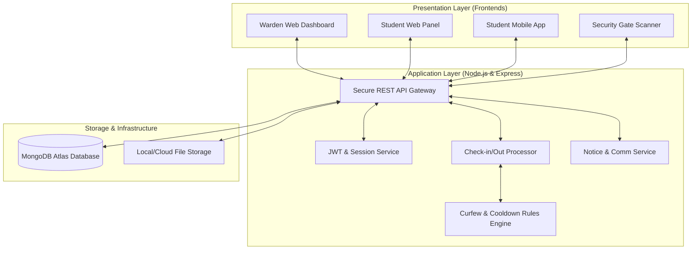
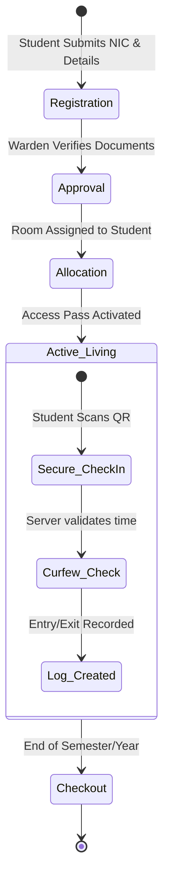
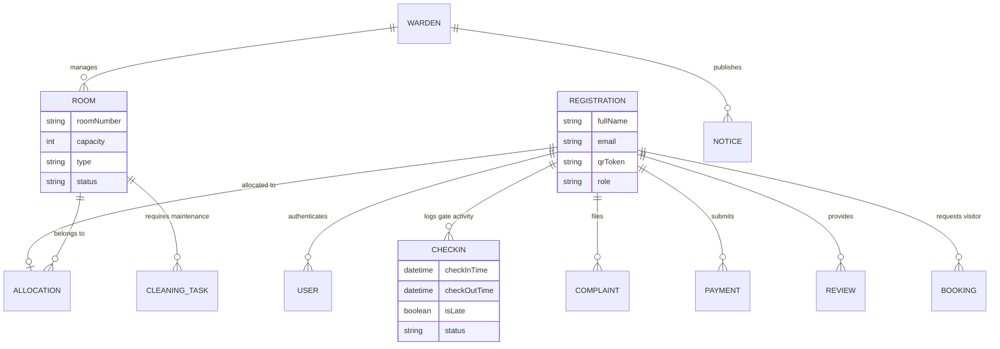
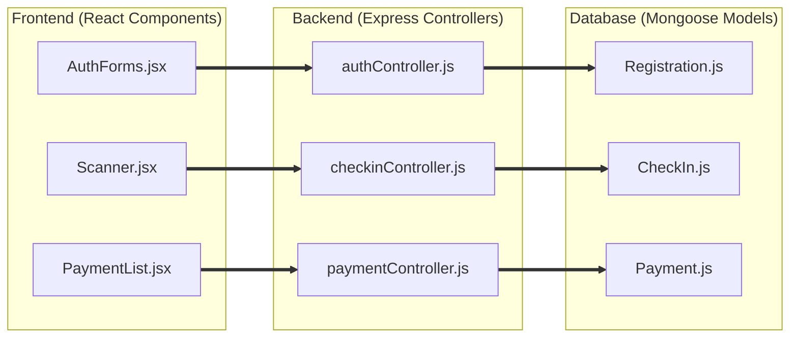

# 📊 Repository Diagrams for Chapter 3

These four diagrams cover the entire SLIIT rubric requirements for Design and Development.

---

## 1. System/Component Architecture Diagram
**Purpose**: Shows how the frontends, backend, and database are connected.

---

## 2. Process / Workflow Diagram (Full Student Cycle)
**Purpose**: Documents the high-level process from registration to daily operations.

---

## 3. Database Design Diagram (ER Diagram)
**Purpose**: Displays the relationships between data entities.

---

## 4. Development-Related Diagram (MERN Mapping Model)
**Purpose**: Maps code components to their technical implementation layers.

